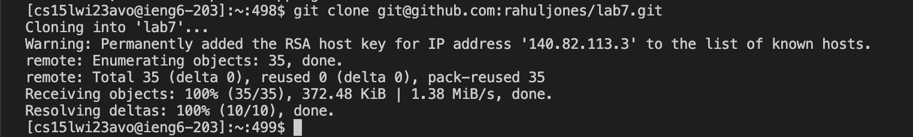

# Lab Report 2

**Step 1: Log into ieng6**

Keys pressed: <Cmnd-C>, <Cmnd-V>, <enter>
  
The ssh command was saved in my notes, so I copy and pasted it into the terminal.

**Step 2: Clone your fork of the repository from your Github account**

I typed in `git clone` followed by the ssh link to the github fork

**Step 3: Run the tests, demonstrating that they fail**

Keys pressed: cd L, <tab>, 7, <enter>, 
I typed in cd L then tabbed to autocomplete and then added the 7. I then hit the up key 12 times to get the command to compile the java files `javac -cp .:lib/hamcrest-core-1.3.jar:lib/junit-4.13.2.jar *.java`. Then I hit the up key 12 times to get the command to run the JUnit tests `java -cp .:lib/hamcrest-core-1.3.jar:lib/junit-4.13.2.jar org.junit.runner.JUnitCore ListExamplesTests`.
  

**Step 4: Edit the code file to fix the failing test**

**Step 5: Run the tests, demonstrating that they now succeed**

**Step 6: Commit and push the resulting change to your Github account **
