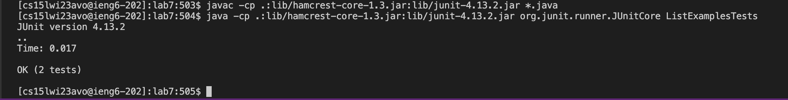

# Lab Report 4

**Step 1: Log into ieng6**

Keys pressed: \<Cmnd-C\>, \<Cmnd-V\>, \<enter\>
  
The ssh command was saved in my notes, so I copy and pasted it into the terminal.

**Step 2: Clone your fork of the repository from your Github account**

I typed in `git clone` followed by the ssh link to the github fork

**Step 3: Run the tests, demonstrating that they fail**

Keys pressed: cd L, \<tab\>, 7, \<enter\>, 
I typed in cd L then tabbed to autocomplete and then added the 7. I then hit the up key 12 times to get the command to compile the java files `javac -cp .:lib/hamcrest-core-1.3.jar:lib/junit-4.13.2.jar *.java`. Then I hit the up key 12 times to get the command to run the JUnit tests `java -cp .:lib/hamcrest-core-1.3.jar:lib/junit-4.13.2.jar org.junit.runner.JUnitCore ListExamplesTests`.
  

**Step 4: Edit the code file to fix the failing test**

Keys pressed: nano L\<tab\>.java, \<down\> x 17 \<right\> \<backspace\> 2, \<crtl o\>\<enter\>\<ctrl x\>

I typed in `nano L` and tabbed in then filled it in to `nano ListExamples.java`. Then I moved down to the line I needed to fix and changed `input1` to `input2` in the last while loop. Then I used crtl o to save and crtl x to exit.

**Step 5: Run the tests, demonstrating that they now succeed**

Keys pressed: \<up\>\<up\>\<up\>\<up\>\<enter\>, \<up\>\<up\>\<up\>\<up\>\<enter\>

I used the up arrows to move to a previous command to run `javac -cp .:lib/hamcrest-core-1.3.jar:lib/junit-4.13.2.jar *.java`. Then I went up again to run `java -cp .:lib/hamcrest-core-1.3.jar:lib/junit-4.13.2.jar org.junit.runner.JUnitCore ListExamplesTests`

**Step 6: Commit and push the resulting change to your Github account **

Keys pressed: git add ListExamples.java \<enter\>, git commit \<enter\>, git push \<enter\>

I used the git add `ListExamples.java`, `git commit`, and `git push` lines to push the changes to my Github account. 
